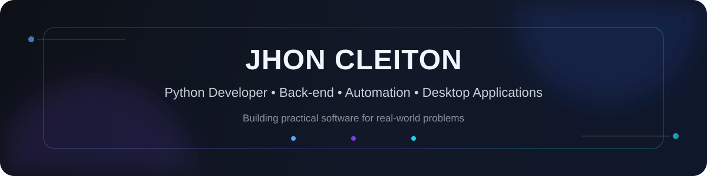

<div align="center">
  
</div>

<br/>

<div align="center">
  <a href="https://github.com/jhoncts?tab=repositories"></a>
  
  
</div>

## 👋 Sobre mim

Sou **desenvolvedor Python** focado em **back-end, automação e aplicações desktop**, cursando Análise e Desenvolvimento de Sistemas.

Gosto de transformar problemas reais e rotinas operacionais em software organizado, rastreável e fácil de usar. Meu portfólio combina **APIs REST, regras de negócio, banco de dados, autenticação, testes automatizados e aplicações para Windows**.

- 🔭 Desenvolvendo e evoluindo projetos próprios com aplicação prática
- 🧠 Foco atual: **Python, FastAPI, SQLAlchemy, arquitetura e automação**
- 🧪 Experiência com processos técnicos, validações e rastreabilidade
- 💼 Aberto a oportunidades em **Desenvolvimento Python, Back-end e Automação**

## 🚀 Projetos em destaque

<table>
<tr>
<td width="50%" valign="top">

### 🧪 ClimateTestManager

Sistema para gerenciamento de ensaios de resistência climática, criado para substituir controles manuais por um fluxo digital, auditável e centralizado.

**Destaques:**
- aplicação cliente-servidor;
- regras de negócio e rastreabilidade;
- autenticação e perfis de acesso;
- SQLite + SQLAlchemy + Alembic;
- testes automatizados;
- notificações, backups e instalador Windows.

**Stack:** Python · Flet · SQLAlchemy · SQLite · Alembic · Pytest

[➡️ Ver projeto](https://github.com/jhoncts/ClimateTestManager)

</td>
<td width="50%" valign="top">

### 🌵 Raízes do Nordeste API

API REST desenvolvida com arquitetura em camadas para operações de usuários, unidades, produtos, estoque, pedidos, pagamentos e auditoria.

**Destaques:**
- autenticação JWT;
- controle de acesso por perfil;
- fluxo de pedidos e estoque;
- migrations com Alembic;
- documentação Swagger;
- testes automatizados com Pytest.

**Stack:** Python · FastAPI · SQLAlchemy · Pydantic · SQLite · JWT

[➡️ Ver projeto](https://github.com/jhoncts/RaizesDoNordesteAPI)

</td>
</tr>
</table>

<div align="center">
  <a href="https://github.com/jhoncts/ClimateTestManager">
    
  </a>
  <a href="https://github.com/jhoncts/RaizesDoNordesteAPI">
    
  </a>
</div>

## 🛠️ Tecnologias

<div align="center">


</div>

## 💡 O que você encontra nos meus projetos

```text
APIs REST            → FastAPI, autenticação, permissões e documentação
Banco de dados       → SQLAlchemy, SQLite, migrations e integridade de dados
Qualidade            → Pytest, validações, tratamento de erros e organização em camadas
Automação            → redução de tarefas manuais e aplicação de regras de negócio
Desktop / Windows    → aplicações Python, distribuição e fluxos operacionais
Git & GitHub         → versionamento, branches, commits e evolução contínua
```

## 📊 GitHub

<div align="center">
  
</div>

---

<div align="center">
  <b>Construindo software útil, um commit de cada vez.</b>
  <br/><br/>
  <a href="https://github.com/jhoncts">GitHub</a>
  &nbsp;•&nbsp;
  <a href="https://github.com/jhoncts?tab=repositories">Projetos</a>
</div>
